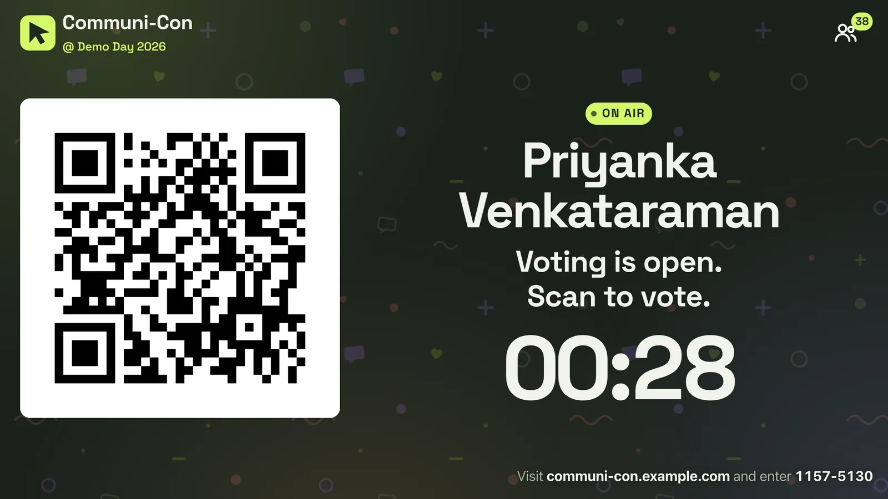
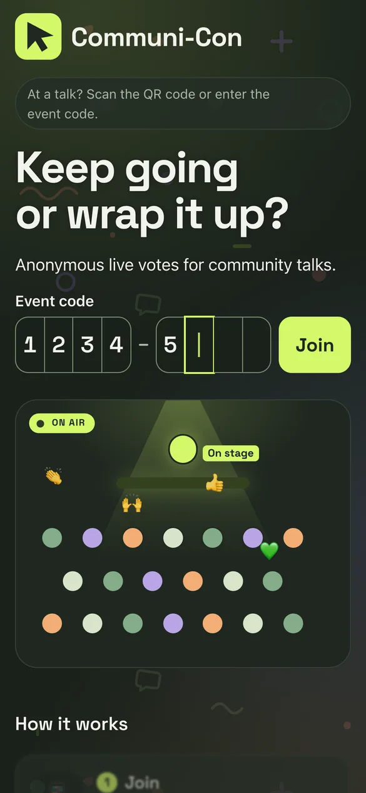
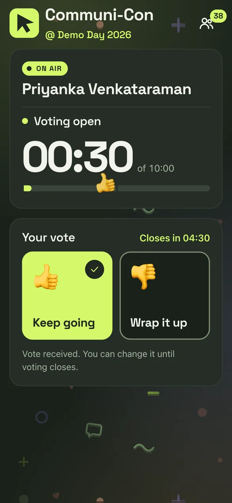
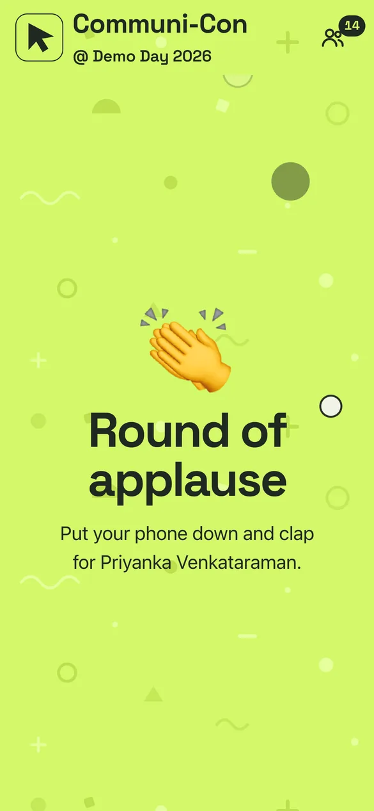
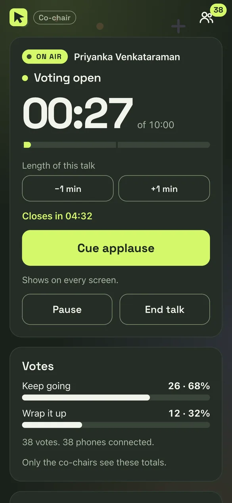
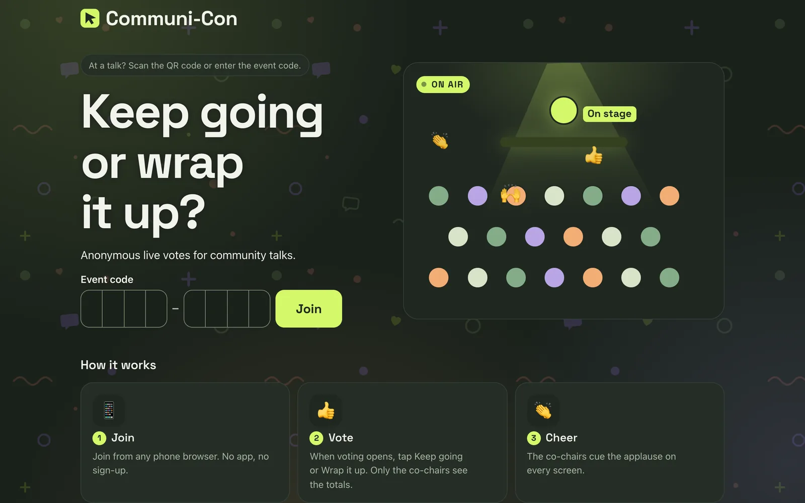
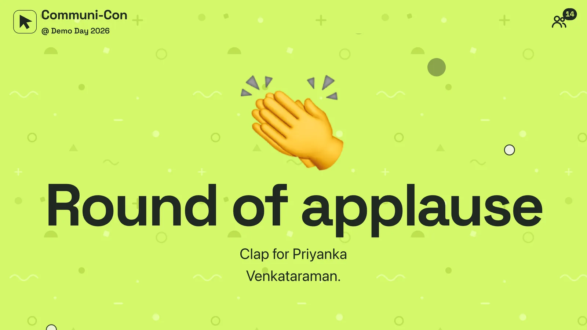

# Communi-Con

Anonymous live votes for community talks. The audience votes on phones. The co-chairs see the totals and cue the applause.

## Screens

<table>
  <tr>
    <td></td>
    <td></td>
    <td></td>
    <td></td>
  </tr>
  <tr>
    <td align="center">Join</td>
    <td align="center">Vote</td>
    <td align="center">Applause</td>
    <td align="center">Co-chair</td>
  </tr>
</table>

<table>
  <tr>
    <td></td>
    <td></td>
  </tr>
  <tr>
    <td align="center">Home page</td>
    <td align="center">Applause on the stage screen</td>
  </tr>
</table>

## Deploy

1. Click **Deploy to Cloudflare**. Cloudflare copies this repository to your GitHub account and deploys it to your Cloudflare account.
1. Set `ADMIN_PASSPHRASE` when Cloudflare asks for it. Co-chairs need this passphrase to create a room.
1. Open `https://<worker>.<subdomain>.workers.dev/admin`.

If the build fails at the install step, add the build variable `PNPM_VERSION` = `12.4.1` in **Settings** > **Build**, then retry the build.

To change the passphrase, set a new value for the `ADMIN_PASSPHRASE` secret in **Settings** > **Variables and Secrets**. Rooms that exist continue to work.

## Run the event

1. Open `/admin` on a phone. Enter an event name (optional) and the passphrase. Tap **Create room**.
1. Open the stage link on the projector. It shows the QR code, the event code, and the next speaker.
1. Tap **Share co-chair link** to give control to the other co-chairs.
1. For each talk: type the speaker name, tap **Start talk**, then **Cue applause**, then **Next talk**.

A talk lasts 10 minutes by default. Voting opens at 05:00 for 5 minutes. Change these values in **Timing**, or tap **Open voting now**.

## Voting

- Each phone votes **Keep going** or **Wrap it up**, and can change the vote until voting closes.
- Only the co-chairs see the totals.
- The first vote from each phone shows a 👍 or 👎 reaction on the phones and the stage screen.

## Limits

- One browser is one participant. There is no ticket check.
- The co-chair link gives full control. Do not show it on the projector.
- A person who guesses an 8-digit room code can open its stage screen and vote.

## Tech Stack

- **Frontend**: [React](https://react.dev) with [Vite](https://vite.dev) and plain CSS
- **Backend**: [Cloudflare Workers](https://workers.cloudflare.com) with static assets
- **Real time**: [Durable Objects](https://developers.cloudflare.com/durable-objects/) through [PartyServer and PartySocket](https://github.com/cloudflare/partykit)
- **Local development**: [Cloudflare Vite plugin](https://developers.cloudflare.com/workers/vite-plugin/), which runs the Worker and the Durable Object in `vite dev`
- **Testing**: [Vitest](https://vitest.dev) with the [Workers Vitest integration](https://developers.cloudflare.com/workers/testing/vitest-integration/)
- **Tooling**: TypeScript, [oxlint and oxfmt](https://oxc.rs)
- **Deployment**: [Wrangler](https://developers.cloudflare.com/workers/wrangler/), or the Deploy to Cloudflare button
- **Package manager**: [pnpm](https://pnpm.io)

## Contribute

Read [CONTRIBUTING.md](CONTRIBUTING.md).

## License

[MIT](LICENSE)
